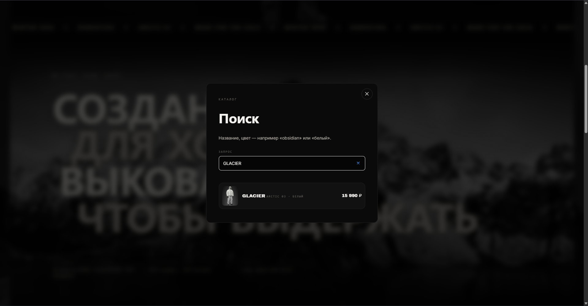
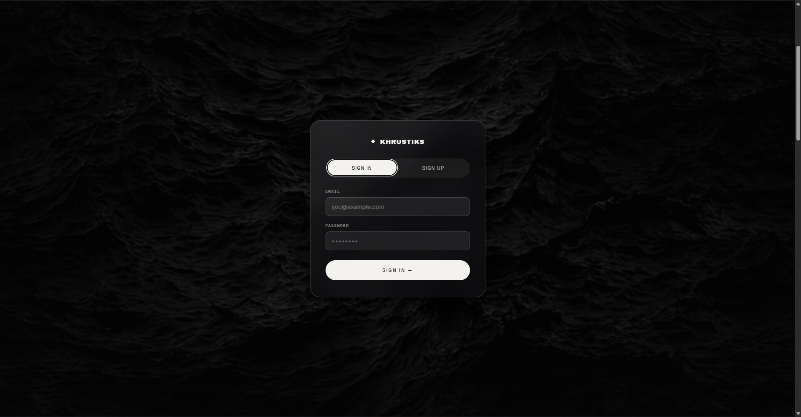
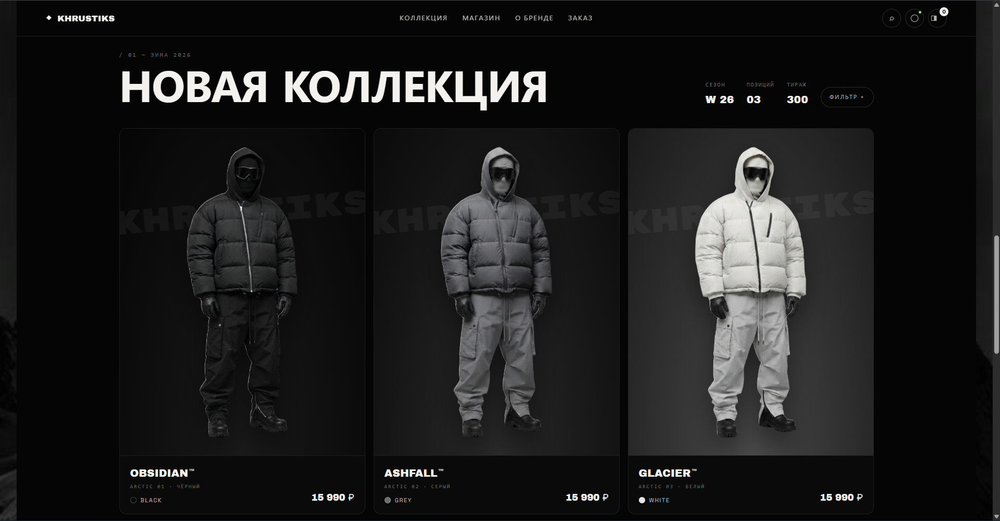
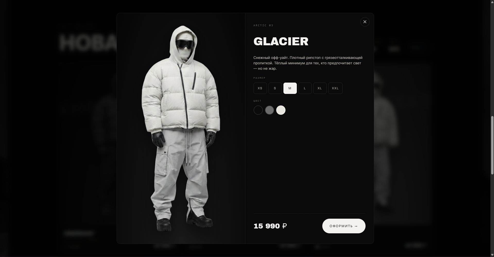
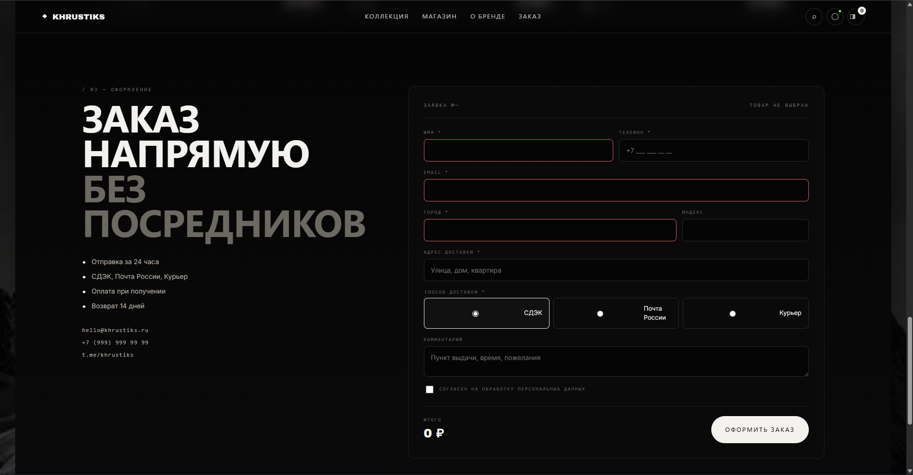
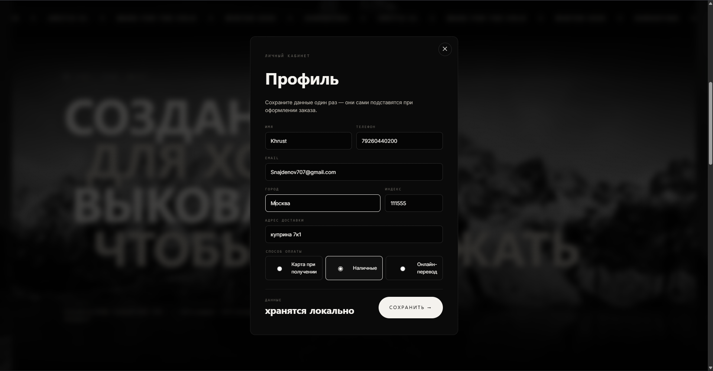

# 🧥 KHRUSTIKS — премиум-магазин пуховиков

Одностраничный интернет-магазин пуховиков в тёмном премиум-стиле.
Собран как учебно-портфолийный кейс: сквозной сценарий покупки от
первого экрана до реальной заявки в базе данных.

> Живой сайт локально: `python -m http.server 5178` → [http://localhost:5178](http://localhost:5178)

---

## 🎯 Что умеет

**Витрина:**
- Full-bleed hero-секция с фигурой модели по центру, размытой граффити-надписью бренда позади и «светом от лампы» сверху
- Три товара (OBSIDIAN / ASHFALL / GLACIER — чёрный / серый / белый) — клик по миниатюре справа переключает фото и цену в реальном времени
- Быстрый выбор размера (XS-XXL) сразу на первом экране — подхватывается модалкой товара, повторно выбирать не нужно
- Секция-манифест «СОЗДАН ДЛЯ ХОЛОДА / ВЫКОВАН ЧТОБЫ ВЫДЕРЖАТЬ» с ч/б горным баннером
- Каталог 3 карточек с водяным знаком KHRUSTIKS за фигурой, кружком-цветом и артикулом
- Модалка товара со сменой размера/цвета и переходом в форму заказа
- Бегущая строка бренд-фраз внизу hero

**Функционал:**
- 🔐 **Auth Gate** — Sign In / Sign Up первым экраном (glassmorphism-плашка на фоне)
- 👤 **Профиль** — форма с именем, телефоном, email, адресом и способом оплаты; данные сохраняются в `localStorage` и автоматически подставляются в форму заказа
- 🔍 **Поиск по каталогу** — модалка с живым фильтром по названию, цвету, артикулу
- 🛒 **Форма заказа** с валидацией и записью в реальную БД (Supabase)
- 📱 Полный адаптив (390px / 768px / 1440px / 1980px — прогонял вручную на каждой ширине)

**Дизайн-язык:**
- Строго монохромная палитра (`#050505` / `#f4f2ee` / `#6d6a63`)
- Три шрифта: `Archivo Black` (дисплей) / `Space Grotesk` (condensed) / `Inter` (body)
- Плёнка шума через SVG-фильтр поверх всего сайта
- Глубина только через границы и `drop-shadow`, без flat-теней
- Скруглённая «плашка» сайта на фоне горы (`<html>` даёт фон, `<body>` — сам сайт с отступом)

---

## 🛠 Стек

| Слой | Технология |
|---|---|
| Разметка | HTML5 (семантические теги, `<dialog>`-подобные модалки) |
| Стили | CSS3: Grid, Flexbox, **Container Queries** (`cqw`), **backdrop-filter**, custom properties, SVG-фильтры |
| Скрипты | Vanilla JavaScript (без фреймворков) — модалки, состояние, живой поиск, работа с REST API |
| База данных | **Supabase** (PostgreSQL 17) с RLS-политиками |
| Шрифты | Google Fonts (Archivo Black, Space Grotesk, Inter, Rubik Mono One) |
| Локальный сервер | `python -m http.server` (проект статический — можно раздавать любым веб-сервером) |

Особенности реализации:
- Форма заказа работает через прямой POST в Supabase REST API с публичным `publishable`-ключом. Читать чужие данные этим ключом нельзя — включён Row Level Security с политикой «только INSERT для роли `anon`».
- Профиль хранится в `localStorage` — при повторной покупке контакты и адрес подставляются сами, ничего не затирая уже введённого.

---

## 🚀 Как запустить локально

```bash
git clone https://github.com/snajdenov707-lang/khrustiks-store.git
cd khrustiks-store

# Запуск встроенного Python-сервера (сборка не нужна — проект статический)
python -m http.server 5178
```

Открыть в браузере: **[http://localhost:5178](http://localhost:5178)**

**Требования:** Python 3.6+ (для локального сервера) или любой другой статический сервер — `npx serve`, `live-server`, VSCode Live Server, XAMPP и т.п.

**Backend Supabase уже подключён** — свой инстанс поднимать не нужно, всё работает из коробки. Если хочешь свою БД:

1. Создай проект на [supabase.com](https://supabase.com)
2. Выполни SQL из миграции в новом проекте:
   ```sql
   create table public.orders (
     id uuid primary key default gen_random_uuid(),
     order_no text, product text, color text, size text, price numeric,
     name text, phone text, email text,
     city text, zip text, address text, delivery text, comment text,
     status text default 'новая', source text,
     created_at timestamptz default now()
   );
   alter table public.orders enable row level security;
   create policy "Anyone can submit an order"
     on public.orders for insert to anon with check (true);
   ```
3. В `script.js` замени константы `SUPABASE_URL` и `SUPABASE_KEY` на свои (Publishable/anon-ключ)

---

## 📁 Структура проекта

```
khrustiks-store/
├── index.html              # разметка всей страницы + модалки
├── styles.css              # тёмная тема, адаптив, анимации
├── script.js               # каталог, модалки, поиск, профиль, отправка заказа
│
├── assets/                 # медиа (все фото сгенерированы через Gemini + remove-bg)
│   ├── model-obsidian-cutout.png   # PNG без фона, три цвета куртки
│   ├── model-ashfall-cutout.png
│   ├── model-glacier-cutout.png
│   ├── фонхиро2.jpg                # фон hero (тёмная дюна)
│   ├── фондляфона.jpg              # общий фон сайта (гора за плашкой)
│   ├── фонрег.jpg                  # фон окна Sign In / Sign Up
│   └── story-mountains.jpg         # ч/б баннер секции-манифеста
│
├── crm/
│   ├── supabase.md         # инструкция по CRM (основной способ)
│   ├── setup.md            # опциональный дубль в Google Sheets
│   └── apps-script.gs      # готовый Apps Script для дубля в Google Sheets
│
├── gemini-prompts.md       # промпты для генерации фото модели/гор через Gemini
├── LICENSE                 # MIT
└── README.md               # этот файл
```

---

## 📸 Скриншоты

### Поиск по каталогу
Модалка с живым фильтром — поиск по названию, цвету, артикулу. Открывается
из иконки лупы в шапке, оформлена в одном стиле с модалкой профиля.



### Auth Gate — Sign In / Sign Up
Первый экран сайта: стеклянная плашка (`backdrop-filter: blur(28px)`)
поверх тёмной текстурной подложки. Переключатель вкладок, после сабмита
форма закрывается и открывается сам магазин.



### Каталог — «Новая коллекция»
Три карточки в ряд (OBSIDIAN / ASHFALL / GLACIER) с водяным знаком бренда
за фигурой, кружком цвета и артикулом.



### Модалка товара
Смена размера (XS–XXL) и цвета прямо в модалке; кнопка «Оформить»
пробрасывает выбор в форму заказа и скроллит к ней.



### Форма заказа
Валидация полей, выбор способа доставки (СДЭК / Почта / Курьер), чекбокс
согласия на обработку ПДн. Отправка — прямой POST в Supabase REST API.



### Профиль
Модалка личного кабинета с формой контактов и способом оплаты. Данные
хранятся в `localStorage` и автоподставляются при следующем оформлении
заказа. Точка-индикатор на иконке в шапке подсвечивается, когда профиль
заполнен.



---

## 🎨 Пайплайн работы с фото

Все модели/фоны — AI-генерация с последующей ручной доработкой:

1. **Референс** — приложен как якорь позы, света, композиции ([`gemini-prompts.md`](./gemini-prompts.md) — все промпты и правила)
2. **Gemini** генерирует базовое фото (студийный фон #808080 для чистого cutout)
3. **remove-bg** вырезает фон → PNG с прозрачностью (проверено: color-type 6 = RGBA)
4. **Pillow / ImageMagick** обрезает лишние прозрачные поля до плотной рамки вокруг фигуры
5. **CSS `filter: drop-shadow`** даёт реалистичную тень при интеграции

Такой пайплайн гарантирует, что 3 модели в разных цветах имеют одинаковую позу и свет — критично для консистентности каталога.

---

## 🔜 Что можно доработать (roadmap)

Честный список того, чего сейчас нет — это плюс для портфолио, показывает
что понимаю жизненный цикл продукта, а не только «нарисовать красиво»:

- 💳 **Реальная онлайн-оплата** — сейчас в форме только выбор способа (карта/наличные/перевод при получении), нет интеграции с ЮKassa/Тинькофф/Stripe
- 📦 **Расчёт доставки** — интеграция с СДЭК/Почтой России API для точной стоимости и сроков
- 🔔 **Уведомления менеджеру о новой заявке** в Telegram и на почту (через Supabase Database Webhook или Edge Function — займёт 15 минут)
- 🔐 **Настоящая авторизация** — Sign In / Sign Up сейчас без валидации, просто UX-плейсхолдер. Полноценно — через Supabase Auth (email/пароль, OAuth), с личным кабинетом «мои заказы»
- 📝 **Юридические документы** — публичная оферта, политика обработки персональных данных, реквизиты ИП/ООО, страница возвратов — обязательно для реальной продажи в РФ
- ⭐ **Отзывы к товарам** — блок с оценками покупателей на карточке
- 📊 **Остатки по размерам** — сейчас все размеры всегда доступны, реально нужно связывать с таблицей `inventory` в БД
- 🌍 **Хостинг и домен** — сейчас только локально/GitHub, для продакшена — Vercel/Netlify + свой домен, Cloudflare для картинок
- 📈 **Аналитика** — Яндекс.Метрика / Google Analytics, событийная модель воронки
- 🖼 **Реальные фото товара** — сейчас AI-модели, для продакшена нужна фотосессия с профессионалом

---

## 👨‍💻 Автор

**Найденов Станислав** — студент университета «Синергия», 3 курс.

- 💬 Telegram: [@khrustiks42](https://t.me/khrustiks42)
- 🐙 GitHub: [@snajdenov707-lang](https://github.com/snajdenov707-lang)

Открыт к фриланс-заказам: одностраничники, интернет-магазины, лендинги,
интеграция с Supabase / Firebase, приём заявок в CRM.

---

## 📄 Лицензия

MIT — можно использовать код как основу для своих проектов. См. [`LICENSE`](./LICENSE).
